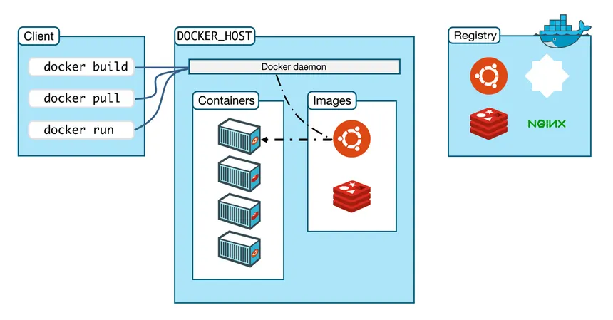
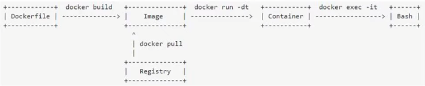
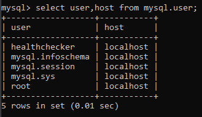
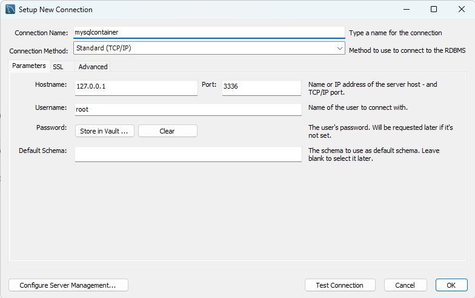

# Docker Tutorial


## what is docker?

## Architecture of Docker


==> DockerFile ==> Docker Image ==> Docker Container ==> Bash Shell (Access Application)
==> can use Registry to pull docker image

- Client-Server Architecture
- `Docker Client`(docker): stores the statement of the application
- `Docker Daemon`(dockerd): stores the docker images and containers
- `Images`: are Retrieved and manage Object in Docker Server
- `Container`: is Dependency Application from Docker Image
- `Docker Registry`: stores and Shares the Docker Images

## Image and Container
### Image
- Image is like a blueprint or a recipe.
- It contains everything needed to run an application:
  - Code
  - Running 
  - Libraries
  - Environment variables
  - Configuration files
- Images are read-only. once built, you don't change directly.
- Images can store in a registry like Docker Hub or a private registry.

### Container
- A container í a running instance of an image.
- it's adds a writable layer on top of the image, so you can run and modify it.
- you can:
  - start/stop/restart containers
- when a container is deleted, all changes made to it are lost unless you commit those changes to a new image.

## Target of Docker
- After try to deploy and back again


## Setup Docker on windows
- Download Docker Desktop from [here](https://www.docker.com/products/docker-desktop/)
- Fix the WSL 2 issue if you have any
    - Open Control Panel > Programs > Turn Windows features on or off
    - Check and Turn on:
      - Windows Subsystem for Linux
      - Virtual Machine Platform
      - windows Hypervisor Platform
      - 
    - Restart your computer if prompted.

- After that, Test:
  - open cmd 
  - docker run -d -p 80:80 docker/getting-started (to pull getting-started image and run it in a container)
  - http://localhost/tutorial/ 
  - 
  - Completed Setup Docker on Windows

---------------------
<br/>

## Setup docker with mysql

- Download mysql image from docker hub latest version
```bash
docker run --name mysqlcontainer -e MYSQL_ROOT_PASSWORD=123456 -p 3336:3306 -d mysql/mysql-server:latest
```

- into bash of mysql container
```bash
docker exec -it mysqlcontainer bash
```
- bash-4.4# `mysql -u root -p` (to login mysql in bash)
- After that enter password .....
- You can try query: `select user,host from mysql.user;`
- 

- setup all host can access username root
```bash
update mysql.user set host='%' where user = 'root' and host='localhost';
```
- And call select again to check
- finish use `exit` to exit mysql and use `exit` to exit bash

### setup mysql workbench to connect mysql in docker
- Restart or start mysql container if you stop it.
- Open mysql workbench
- Setup new connection
  - `Connection Name`: mysqlcontainer
  - `Connection Method`: Standard (TCP/IP)
  - `Hostname`: 127.0.0.1
  - `Port`: 3336
  - `Username`: root
  - `Password`: Store in Vault... (enter 123456)
  - 
  - `Test Connection`
  - `OK`
  - `Login` if ok you connected successfully

## Deploy Spring Boot on docker
# On intelliJ
- Open your spring boot project
- clean and package your project to get jar file
- Config Dockerfile
```dockerfile
#base image: linux with java 21
FROM openjdk:21-rc-jdk-oracle

# copy jar from local into docker image.
COPY target/order_service-0.0.1-SNAPSHOT.jar /order_service-0.0.1-SNAPSHOT.jar

# command line to run jar
ENTRYPOINT ["java","-jar","/order_service-0.0.1-SNAPSHOT.jar"]
```
  - `FROM openjdk:21-rc-jdk-oracle`.
    - (openjdk on https://hub.docker.com/_/openjdk/tags?name=21&page=5)
    - (21-rc-jdk-oracle is tag of openjdk) and i use java 21.
  - `COPY target/order_service-0.0.1-SNAPSHOT.jar /order_service-0.0.1-SNAPSHOT.jar`
    - copy jar from local into docker image.
    - target/order_service-0.0.1-SNAPSHOT.jar is path of jar in local
    - /order_service-0.0.1-SNAPSHOT.jar` is name of jar in docker image
- ENTRYPOINT ["java","-jar","/order_service-0.0.1-SNAPSHOT.jar"] (command line to run jar)
  - java -jar same statement to run java on terminal
  - And /order_service-0.0.1-SNAPSHOT.jar is name of jar call into to run
- Build docker image:
  - docker `build` → tells Docker to build an image
  - `-t` (short for --tag) → assigns a name and optionally a version (tag)
  - `orderservice:0.0.1` → image name = orderservice, tag = 0.0.1
  - `.` → build context (current directory, must contain a Dockerfile)
```bash
docker build --tag=orderservice:0.0.1 .
```

- After build success, start image with spring boot port 8083 and map to 9999 of localhost of docker:
```bash
docker run -p 9999:8083 orderservice:0.0.1
```

- if want check container is running or not
```bash
docker command ls # show all containers (running and stopped).
docker command ps # Shows running containers only (by default).
```

