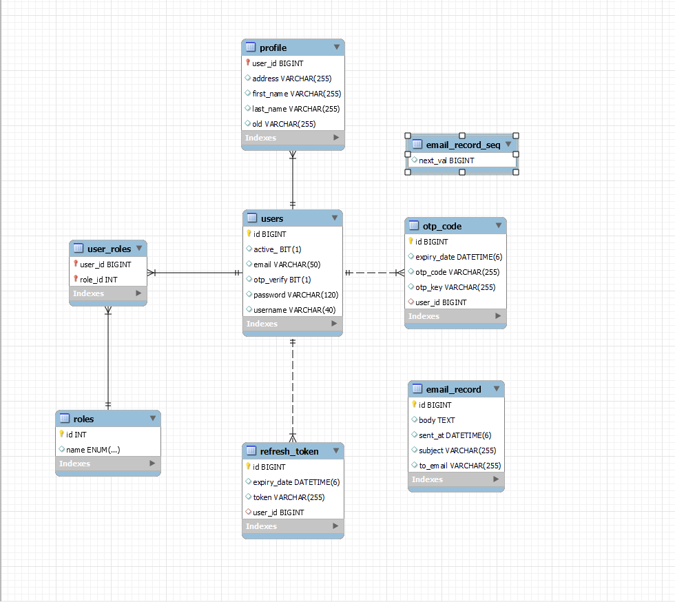

# Overview 

Api:
 - signin
 - signup
 - forgot-password
 - otp
 - resend-otp
 - profile
 - update-profile

### DB:


### Library

```pom
	<parent>
		<groupId>org.springframework.boot</groupId>
		<artifactId>spring-boot-starter-parent</artifactId>
		<version>3.3.12</version>
		<relativePath/> <!-- lookup parent from repository -->
	</parent>
    <properties>
            <java.version>17</java.version>
            <lombok.version>1.18.30</lombok.version>
        </properties>
    <dependencies>
            <dependency>
                <groupId>org.springframework.boot</groupId>
                <artifactId>spring-boot-starter-web</artifactId>
            </dependency>
            <dependency>
                <groupId>org.springframework.boot</groupId>
                <artifactId>spring-boot-starter-data-jpa</artifactId>
            </dependency>
            <dependency>
                <groupId>org.springframework.boot</groupId>
                <artifactId>spring-boot-starter-security</artifactId>
            </dependency>
    
            <dependency>
                <groupId>org.springframework.boot</groupId>
                <artifactId>spring-boot-devtools</artifactId>
                <scope>runtime</scope>
                <optional>true</optional>
            </dependency>
            <dependency>
                <groupId>com.mysql</groupId>
                <artifactId>mysql-connector-j</artifactId>
                <scope>runtime</scope>
            </dependency>
            <dependency>
                <groupId>org.projectlombok</groupId>
                <artifactId>lombok</artifactId>
                <optional>true</optional>
                <version>${lombok.version}</version>
            </dependency>
            <dependency>
                <groupId>org.springframework.boot</groupId>
                <artifactId>spring-boot-starter-test</artifactId>
                <scope>test</scope>
            </dependency>
            <dependency>
                <groupId>org.springframework.security</groupId>
                <artifactId>spring-security-test</artifactId>
                <scope>test</scope>
            </dependency>
    
            <dependency>
                <groupId>org.springframework.boot</groupId>
                <artifactId>spring-boot-starter-mail</artifactId>
            </dependency>
        </dependencies>
    
        <build>
            <plugins>
                <plugin>
                    <groupId>org.apache.maven.plugins</groupId>
                    <artifactId>maven-compiler-plugin</artifactId>
                    <configuration>
                        <annotationProcessorPaths>
                            <path>
                                <groupId>org.projectlombok</groupId>
                                <artifactId>lombok</artifactId>
                                <version>${lombok.version}</version>
                            </path>
                        </annotationProcessorPaths>
                    </configuration>
                </plugin>
                <plugin>
                    <groupId>org.springframework.boot</groupId>
                    <artifactId>spring-boot-maven-plugin</artifactId>
                    <configuration>
                        <excludes>
                            <exclude>
                                <groupId>org.projectlombok</groupId>
                                <artifactId>lombok</artifactId>
                            </exclude>
                        </excludes>
                    </configuration>
                </plugin>
            </plugins>
        </build>
```
#
### Create [UserRepository.java](src%2Fmain%2Fjava%2Fcom%2Falan%2Fsecurity%2Frepositories%2FUserRepository.java)
```java
import com.alan.security.model.entity.User;
import org.springframework.data.jpa.repository.JpaRepository;
import org.springframework.stereotype.Repository;

import java.util.Optional;

@Repository
public interface UserRepository extends JpaRepository<User, Long> {
  Optional<User> findByUsername(String username);
  Optional<User> findByUsernameAndActiveIsAndOtpVerifyIs(String username, boolean active, boolean acceptIs);

  Boolean existsByUsername(String username);

  Boolean existsByEmail(String email);
}
```
#
### Create [UserDetailsImpl.java](src%2Fmain%2Fjava%2Fcom%2Falan%2Fsecurity%2Fservice%2Fuser%2FUserDetailsImpl.java)
```java
import com.alan.security.model.entity.User;
import com.fasterxml.jackson.annotation.JsonIgnore;
import org.springframework.security.core.GrantedAuthority;
import org.springframework.security.core.authority.SimpleGrantedAuthority;
import org.springframework.security.core.userdetails.UserDetails;
import org.springframework.stereotype.Service;

import java.util.Collection;
import java.util.List;
import java.util.Objects;
import java.util.stream.Collectors;

/**
 Object of  user detail
 * */
@Service
public class UserDetailsImpl implements UserDetails {
  private static final long serialVersionUID = 1L;

  private Long id;

  private String username;

  private String email;

  @JsonIgnore
  private String password;

  private Collection<? extends GrantedAuthority> authorities;

  public UserDetailsImpl(Long id, String username, String email, String password,
                         Collection<? extends GrantedAuthority> authorities) {
    this.id = id;
    this.username = username;
    this.email = email;
    this.password = password;
    this.authorities = authorities;
  }
  public UserDetailsImpl() {

  }

  /**
   method to build UserDetail (called user detailsService Impl for return UserDetail)
   */
  public UserDetailsImpl build(User user) {
    List<GrantedAuthority> authorities = user.getRoles().stream()
        .map(role -> new SimpleGrantedAuthority(role.getName().name()))
        .collect(Collectors.toList());

    return new UserDetailsImpl(
        user.getId(), 
        user.getUsername(), 
        user.getEmail(),
        user.getPassword(), 
        authorities
    );
  }

  @Override
  public Collection<? extends GrantedAuthority> getAuthorities() {
    return authorities;
  }

  public Long getId() {
    return id;
  }

  public String getEmail() {
    return email;
  }

  @Override
  public String getPassword() {
    return password;
  }

  @Override
  public String getUsername() {
    return username;
  }

  @Override
  public boolean isAccountNonExpired() {
    return true;
  }

  @Override
  public boolean isAccountNonLocked() {
    return true;
  }

  @Override
  public boolean isCredentialsNonExpired() {
    return true;
  }

  @Override
  public boolean isEnabled() {
    return true;
  }

  @Override
  public boolean equals(Object o) {
    if (this == o)
      return true;
    if (o == null || getClass() != o.getClass())
      return false;
    UserDetailsImpl user = (UserDetailsImpl) o;
    return Objects.equals(id, user.id);
  }
}
```
#
### Create [UserDetailsServiceImpl.java](src%2Fmain%2Fjava%2Fcom%2Falan%2Fsecurity%2Fservice%2Fuser%2FUserDetailsServiceImpl.java)
```java
import com.alan.security.exception.ResourceException;
import com.alan.security.model.entity.User;
import com.alan.security.repositories.UserRepository;
import org.springframework.beans.factory.annotation.Autowired;
import org.springframework.security.core.userdetails.UserDetails;
import org.springframework.security.core.userdetails.UserDetailsService;
import org.springframework.security.core.userdetails.UsernameNotFoundException;
import org.springframework.stereotype.Service;
import org.springframework.transaction.annotation.Transactional;

/**
 * interface has a method to load
 * User by username and returns a UserDetails object that Spring Security can use for authentication and validation
 *
 * @return load user and Return userDetail to authentication and validation
 */
@Service
public class UserDetailsServiceImpl implements UserDetailsService {
    @Autowired
    private UserRepository userRepository;

    @Autowired
    private UserDetailsImpl userDetails;

    public static final String USER_NOT_FOUND = "Username not found ";

    @Override
    @Transactional
    public UserDetails loadUserByUsername(String username) throws UsernameNotFoundException {
        User user = userRepository.findByUsernameAndActiveIsAndOtpVerifyIs(username, true, true)
                .orElseThrow(() -> new ResourceException(USER_NOT_FOUND));

        return userDetails.build(user);
    }

}
```
